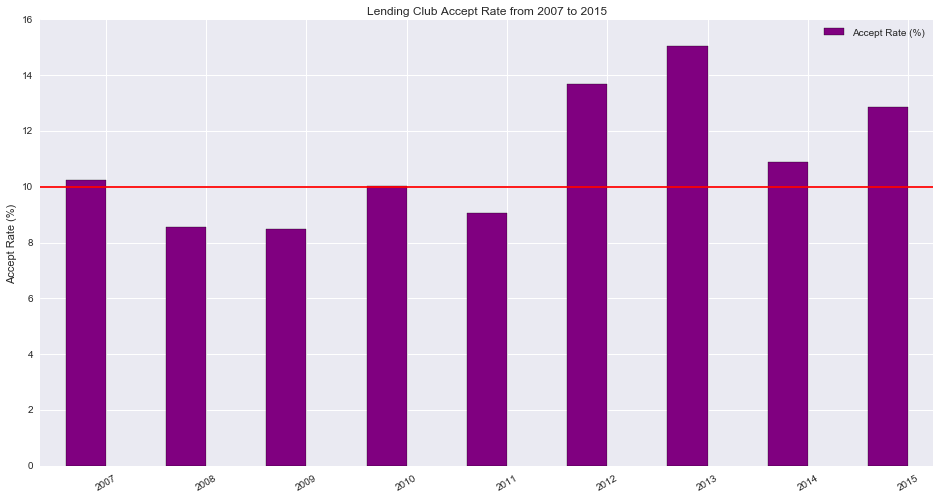
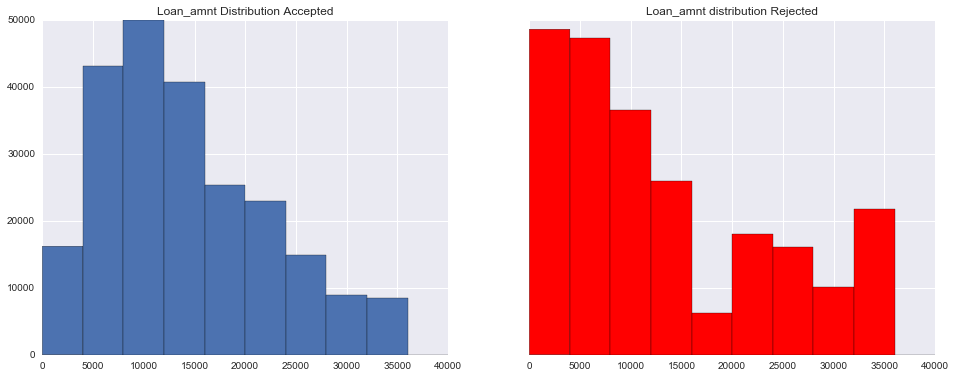
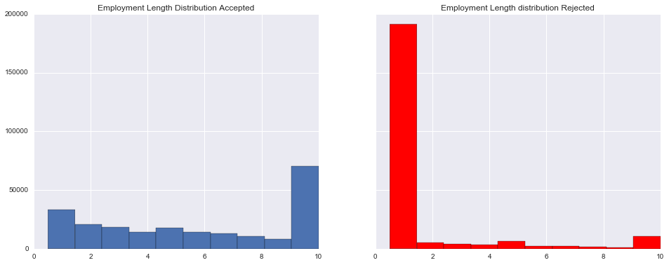
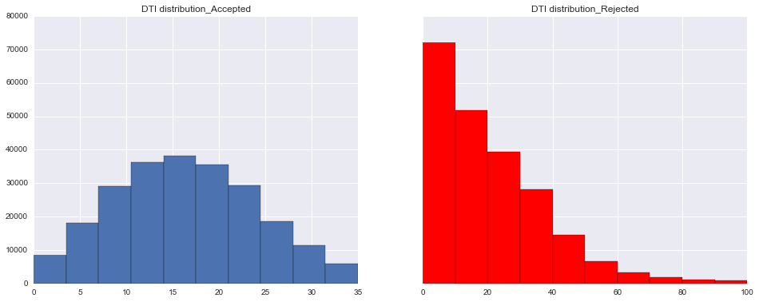
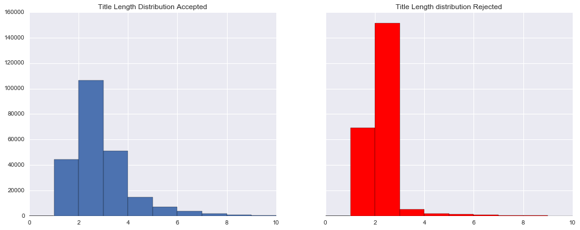
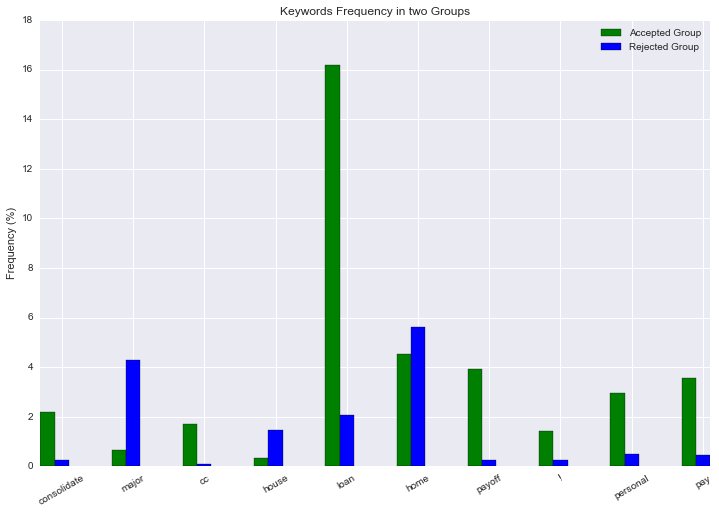
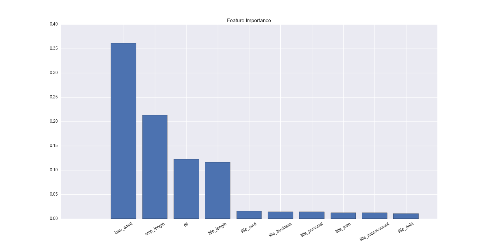

# Loan Helper: Are you able to get money from Lending Club?

Loan Helper could predict the probability of whether you are able to get a loan from Lending Club. At the same time, provide suggestions about how to obtain a higher chance to get the money. Try it at: ?????????

## Motivations and Goals
As "the world's largest online marketplace connecting borrowers and investor"1, Lending club would evaluate each borrower' credit history, employment length, debt-to-income(dti) ratio, reasons to borrow money other information1, in order to determine whether issue the loan or not. Surprisingly, there are only around 10% of the load requests issued. It is obvious that the loan amount, the potential loaner's employment length and credit history on the decision of Lending Club. However, in this project, I want to dig deeper about Lending Club's criteria when they make the decision of whether to grant a loan. In particular, I tried to apply the natural language processing (NLP) in the employment title and/or other sections5 to find whether any kind of specific languages might affect Lending Club's decision to the loan requests. My another goal is to find the favorable words which might increase a potential loaner's chance to get money. At the same time, to find sensitive words which loaners should avoid. Accordingly, based on the loaner's info, I will provide them with suggestions from different perspectives so that the probability of receiving a loan will increase.
 

Lending Club Acceptance Rate from 2007 to 2015:

 

## Solutions and Pipeline

### Data Cleansing and Prepossing  

The dataset comes from the public "loan data" and "declined loan data" from 2007 to 2013 7, as during this time period, there were sufficient 'Loan Title' information to proceed the NLP analysis, i.e. 73641 unique values in the rejection data and 62186 unique values in the accepted data.  
1. Label "rejected" as positive '1' and 'accepted' as negative '0' from both
issued loan and rejected loan requests from 2007 to 2013.

2. Select the basic features as well as NLP features and feature engineering
['loan_amnt', 'dti', 'emp_length']

  Features which will be enforced with NLP features are: 'title' in the accepted data and 'Loan Title' from the rejected data.

  Geo info was not considered in my model.

3. As the sizes of two groups are imbalanced (90% vs. 10%) and the smaller group has more than 230,000 samples. I used undersampling method to rebalance the sample group.

4. EDA on the dataset

  The two groups have obviously distinguished feature-distributions as follows:   

  Loan Amount Distribution Accepted Group vs. Rejected Group:

  

  Employment Length Distribution Accepted Group vs. Rejected Group:

  

  DTI Distribution Accepted Group vs. Rejected Group:

  

  Title Length Distribution Accepted Group vs. Rejected Group:  

  

    Certain features behave differently between accepted group and rejected group. For example, the majority of the successful debtors have an employment history close to 10 years, while the number of the persons with less than 1 year experience dominates the rejected group. In addition, the DTI distribution of the accepted data is obviously a normal distribution with a mean value of 15 while the DTI distribution of the rejected data looks like a geometric distribution. One more important feature is the title length,  potential successful debtors used longer description in the loan title.

5. NLP features:

  As some keywords frequencies in both accepted group and rejected group are different, e.g., the word 'loan' in accepted group is eight times of that in the rejected group (0.162 vs. 0.021), the appearance of such keywords might be a strong indicator to classify the loan request. Therefore, I applied NLP technique to analyze the 'title' section, such as tokenizing the text, removing the stop words and lemmatizing the contents and finally selected the top 20 most frequent words in each group and create new categorical features indicating whether or not such keyword in the user's title section.

  The figure below is some example of the keyword-frequency in two groups:

  

6. Training and testing data: the two groups of data was splited via sklearn default 0.75 vs. 0.25 and missing data were filled in with mean value. In addition, both data were scaled for the next modeling step.

### Parameter Tuning and Model Selection
I select four different models: LogisticRegression, RandomForestClassifier, GradientBoostingClassifier and AdaBoostClassifier and different parameter sets for tuning. The results are as follows:
Tuning Parameters:

1. Model:  LogisticRegression

  Best Parameters:  {'C': 10}

  Best Score:  0.833546246467

2. Model:  RandomForestClassifier

  Best Parameters:  {'n_estimators': 20, 'min_samples_leaf': 3}

  Best Score:  0.915183500292

3. Model:  GradientBoostingClassifier

  Best Parameters:  {'n_estimators': 100, 'learning_rate': 1}

  Best Score:  0.916830927704

4. Model:  AdaBoostClassifier

  Best Parameters:  {'n_estimators': 100, 'learning_rate': 1}

  Best Score:  0.895197604583

Thus, the best model will be GradientBoostingClassifier with Best Parameters:  {'n_estimators': 100, 'learning_rate': 1}.

The cross_validation score on the full model is
0.916417623562, along with the
accuracy, precision and recalls (0.91737765754517397, 0.94841652451234892, 0.88346546453184105), respectively.

### Feature Importance and Analysis

Feature Importance Figure

The feature importance is shown on the above. It makes sense that loan amount and the finance status like dti contribute a lot to Lending Club's decision on whether or not issuing a loan. I also found that the length of the description and specific keywords had made an impact on the decision. For instance, the mean title length of accepted loan requests is 2.39 words while the mean length of the rejected ones is 1.79. And the max-length of the accepted requests is 33 words, while the max-length of the rejected ones is more than 100 words. The above findings leads us to determine that on average there will be higher chance to get a loan with longer description. However, if the description is too long, i.e., more than 33 words, it is a strong indicator that this request will be rejected.

In addition to the length feature, other important NLP features to be incorporated in the model is the keyword features, as some certain words appear more in one group than others. For example, the keyword 'loan's appearance is a relatively strong indicator to determine whether or not to issue a loan as it appears eight times in the accepted group than rejected group.

### Web Service:

The link to 'Loan Helper'
is live at ????

Go to the 'HOME' page, fill in the form and submit. The probability of receiving a loan from Lending Club will be shown. In case that the user might fail to get a loan,  suggestions on how to increase the chance to get a loan will be provided. Please feel free to play around. :)

### Brief Introduction of the Code Structure

1. rej_data_processing.py:

    This module is to pre-processing the data, read in data, select features, rename columns, combine dataframes, label data and write the post-processing dataframe into a json file 'acc_rej_data' for later use.

2. text_analysis.py

  This module is to implement the NLP analysis part, including three methods: bag_of_words, build_dic and plot_top_keywords.

  The "bag_of_words" is to tokenize, remove stopwords and lemmatize a text and return a list of words.

  The "build_dic" is to process a column of a dataframe and return a dictionary containing all the words and their frequencies, and it is like a vocabulary with frequencies info.

  The "plot_top_keywords" is a method to plot the top N keywords and their frequencies.  

3. nlp_feature_extraction.py:

  This module is to create new NLP features and add them as the new columns on the original dataframe, including three methods. Also, the module would generate a new dataframe with NLP features and write to a new json "acc_rej_full_data."

  The "title_length" is to add a new column containing the length of a
  description info.

  The "keyword_lst_generator" is to generate a word_set containing the top N most frequent keywords in two groups.

  The "keyword" method is to generate new categorical features to each row indicating whether the keyword appears in the 'title' section.

4. model.py:

  It contains a class "Model_Pipeline", including the scaling data, fitted model, predict result and obtain scores.

  The input is the dataframe, feature list, label and machine learning model.

5. parameter_tuning.py:

  This module is to implement GridSearchCV to tune the parameters of selected models.

6. eda.py:

  This module is to plot the feature importance and partial_dependence figures, and calculate the scores on the testing data. Another goal is to pickle the scaler and fitted model for the online web-service.

7. app.py:   

  The module implements API endpoints with Flask.

8. Tools: Python (numpy, scipy, sklearn, pandas), flask, AWS EC2 to host my real time web-service.

# Future Work:

1. To provide users with customized suggestions based on the input.  

2. Apply sentiment analysis on NLP features.

# Acknowledgement:
I would like to thank instructors Brad Jacobs, Lee Murray, Ryan Henning, Michael Jancsy and all the DSRs at Galvanize for your advice and help.

Thanks to my classmates for their company for this amazing experience.

Thanks to startbootstrap for their amazing framework.

Many thanks to my family and friends for their understanding and support.

# Reference:

  1.https://www.lendingclub.com/public/steady-returns.action

  2.https://www.lendingclub.com/public/how-peer-lending-works.action

  3.http://cs229.stanford.edu/proj2014/Kevin%20Tsai,Sivagami%20Ramiah,Sudhanshu%20Singh,Peer%20Lending%20Risk%20Predictor.pdf

  4.http://cs229.stanford.edu/proj2015/199_report.pdf

  5.http://www.slideshare.net/firstmarkcap/lendingclub-data-driven-nyc-27-35764856

  6.http://startbootstrap.com/template-overviews/clean-blog/

  7.https://www.lendingclub.com/info/download-data.action

# Copyright:
Copyright (c) 2016 Bing Liang
